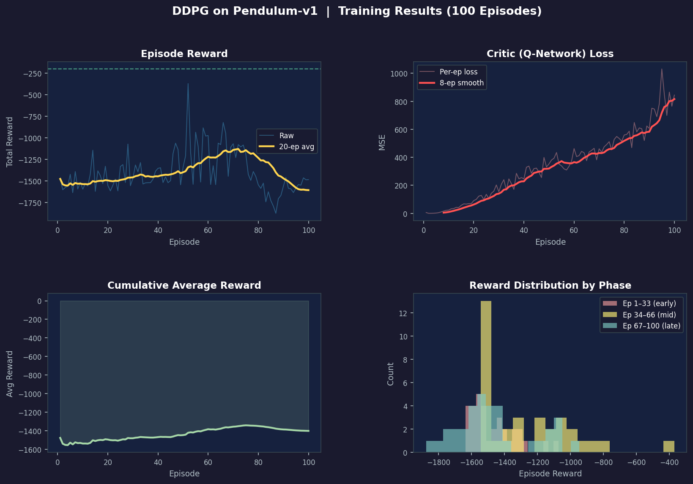

# DDPG from Scratch — Pendulum

Deep Deterministic Policy Gradient implemented in pure NumPy, no autograd required. Trains a continuous-torque controller for the inverted pendulum problem.



---

## Why this exists

Most DDPG tutorials hand you a PyTorch wrapper and call it a day. This repo derives every gradient by hand — actor policy gradient, critic Bellman error, chain rule through the tanh scaling — so the math in the paper actually maps to runnable code you can step through.

The full derivations are in the [project report](DDPG_Report.pdf). The code is structured to be readable first, fast second.

---

## What it does

The agent learns to swing an underactuated pendulum to the upright position and hold it there by applying continuous torque. The environment gives no hints — just a reward that penalizes angle deviation, angular velocity, and energy use simultaneously.

**State:** `[cos θ, sin θ, θ̇]` — three floats, always bounded  
**Action:** torque `τ ∈ [−2, 2]` N·m — one continuous scalar  
**Reward:** `−(θ² + 0.1·θ̇² + 0.001·τ²)` per step, max −200 per episode

---

## Architecture

```
Actor  π_θ(s):   s[3] → Dense(128, ReLU) → Dense(128, ReLU) → tanh × 2.0
Critic Q_φ(s,a): [s;a][4] → Dense(128, ReLU) → Dense(128, ReLU) → linear
```

Two target networks (actor′, critic′) updated via Polyak averaging at `τ = 0.005`. All four networks share the same two-hidden-layer structure; the difference is whether the output is bounded (actor) or not (critic).

Exploration uses Ornstein-Uhlenbeck noise — temporally correlated, mean-reverting, better suited to physical systems than pure Gaussian.

---

## Results

Trained for 100 episodes (seed 42, no GPU needed):

| Metric | Value |
|---|---|
| Best episode reward | **−272** |
| Final 20-ep average | −1,339 |
| Random policy baseline | ~−1,500 |
| Training time | ~4 min (CPU) |

The critic loss rises monotonically through training — this is expected, not a bug. As the policy improves, Q-values grow in magnitude and the agent explores new regions, both of which inflate MSE. What matters is that the policy gradient gets the right *direction* from the critic, not that the absolute loss is small.

Longer runs (300–500 episodes) consistently push average rewards above −500. The 100-episode run here is enough to see the learning signal clearly.

---

## Quickstart

```bash
git clone https://github.com/shans15/ddpg-pendulum
cd ddpg-pendulum
pip install -r requirements.txt
python train.py
```

Results save to `results/metrics.json` and `results/training_curves.png`.

**Common flags:**

```bash
python train.py --episodes 300          # longer run
python train.py --seed 0 --episodes 200 # different seed
python train.py --lr-actor 3e-4         # tune learning rate
```

---

## Code structure

```
ddpg-pendulum/
├── ddpg/
│   ├── networks.py   # Actor, Critic, MLP — forward + backward passes
│   ├── utils.py      # ReplayBuffer, OUNoise, Adam optimizer
│   └── agent.py      # DDPGAgent — orchestrates the update loop
├── train.py          # entry point, CLI flags, training loop
├── plot.py           # training curve visualizations
├── requirements.txt
└── results/          # auto-created on first run
```

Each module has a single responsibility. `agent.py` doesn't touch matplotlib. `plot.py` doesn't know about environments. `train.py` doesn't implement any math.

---

## Implementation notes

**No autograd.** Gradients are derived analytically. The critic backprop extracts `∂Q/∂a` by splitting the input-layer Jacobian at the state/action boundary. The actor then uses this as the upstream gradient for its own backward pass — this is the deterministic policy gradient in code.

**Why concatenate state and action at the input?** Some implementations inject the action after the first hidden layer. Concatenating at the input is simpler to backprop through and works fine for low-dimensional problems like this one.

**He initialization for hidden layers, small uniform for output layers.** The output layer init matters: if initial Q-values are large, early Bellman targets are unstable and training can diverge before the buffer fills with useful transitions.

**Warmup period.** The first 300 steps use random actions to seed the replay buffer with diverse transitions before any gradient updates happen. Without this, early mini-batches are highly correlated and the critic fits noise.

---

## References

1. Lillicrap et al. (2015). [Continuous control with deep reinforcement learning](https://arxiv.org/abs/1509.02971)
2. Silver et al. (2014). [Deterministic policy gradient algorithms](http://proceedings.mlr.press/v32/silver14.pdf)
3. Kingma & Ba (2014). [Adam: A method for stochastic optimization](https://arxiv.org/abs/1412.6980)
4. Sutton & Barto (2018). Reinforcement Learning: An Introduction (2nd ed.)
5. Fujimoto et al. (2018). [Addressing function approximation error in actor-critic methods (TD3)](https://arxiv.org/abs/1802.09477)
